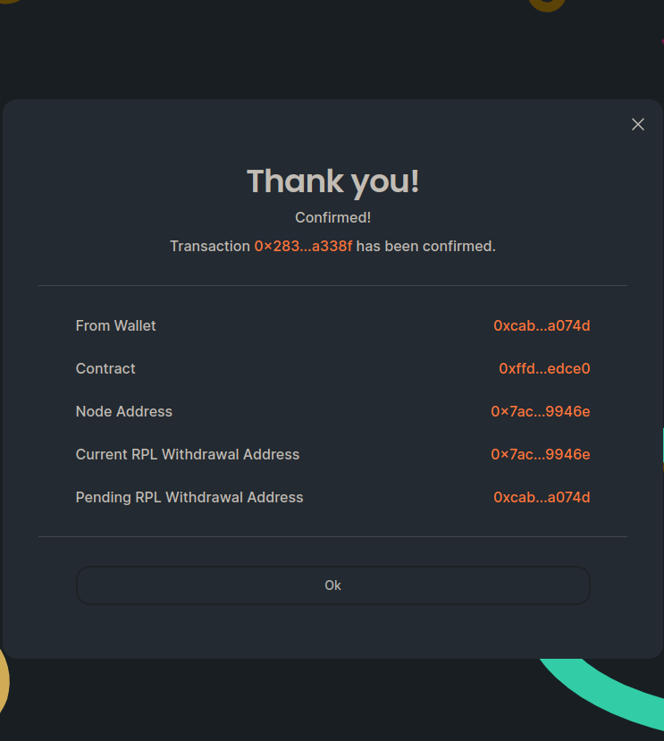
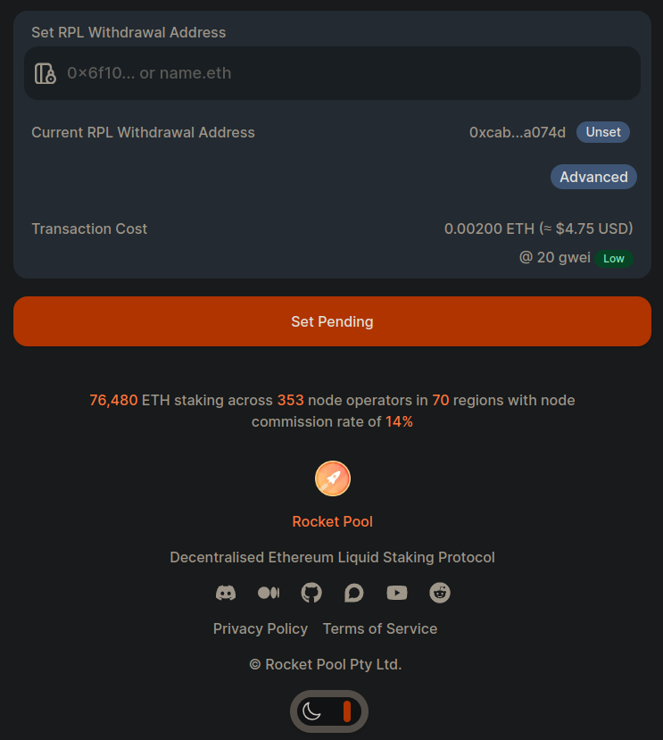

# Setting your RPL Withdrawal Address

It's important to understand the difference between your [primary withdrawal address](../node/prepare-node#setting-your-primary-withdrawal-address) and your RPL withdrawal address. By default, your RPL withdrawal address is unset and your Primary withdrawal address is where all of your RPL checkpoint rewards, your staked RPL, and Beacon Chain ETH will be sent to. 

You can set a [separate withdrawal address for your RPL](https://rpips.rocketpool.net/RPIPs/RPIP-31) if you wish. Your RPL withdrawal address if set will be able to trigger and claim RPL from inflation rewards and will have no effect on ETH consensus rewards or anything related to ETH. In this case, your Primary withdrawal address will no longer have any authority over RPL related actions. 

This creates some interesting opportunities where RPL can be supplied by an entity to a node operator that does not wish to have exposure to RPL. That entity can then claim RPL rewards for putting up the required insurance collateral for the node. In other words, this allows different actors to supply each collateral type.


::: warning NOTE
Upon setting up your node for the first time, your RPL withdrawal address defaults to being unset.
If you choose to set an RPL withdrawal address, **it is vitally important to set this to a different address controlled by a cold wallet.**
A cold wallet could be a hardware wallet (such as a [Ledger](https://www.ledger.com/), [Trezor](https://trezor.io/), or [Grid+](https://gridplus.io/)), or a Smart Contract wallet (such as [Safe](https://app.safe.global/welcome)).

We **strongly recommend** that you DO NOT use a hot wallet such as MetaMask as your RPL withdrawal address.

This way, if your node wallet is compromised, the attacker doesn't get access to your staked RPL by forcing you to exit because all of those funds will be sent to your separate cold wallet (which they hopefully do not have).

RPL withdrawal addresses are set at a node operator level.
If you create multiple minipools, they will all refer to the same RPL withdrawal address so you only need to perform this setup once.

[See here](https://ethereum.org/en/security/#wallet-security) for some basics on wallet security from the Ethereum Foundation.
:::

There are two different ways to do this.
Please read both options below to determine which one applies to you.

:::::: tabs
::::: tab Method 1
**Use this method if your new RPL withdrawal address can be used to sign transactions via MetaMask or WalletConnect.**

::: warning NOTE
This method will require you to **submit a transaction** from your new RPL withdrawal address, so **you must have a small amount of ETH in that address already.**
:::

::: warning NOTE
For users of **Ledger** hardware wallets, note that Ledger Live does not yet support MetaMask or WalletConnect natively.
You will need to use MetaMask and connect it to your Ledger instead.
Follow [the official Ledger instructions](https://www.ledger.com/academy/security/the-safest-way-to-use-metamask) to do this.

To work with the Rocket Pool website, you will need to have your Ledger connected, unlocked, and the ETH app open.
You will also need to **enable "blind signing"** for the current session; you can find this within the Settings portion of the ETH app on the device.
Bind signing will automatically be disabled after you close the session.

If you are using Holesky Testnet and want to use your Ledger as your RPL withdrawal address, **you must create a new Ethereum wallet on your Ledger** first to ensure you don't connect your live address to the test network, which tends to cause confusion.
Make sure to select the **Holesky Testnet** in the network selection dropdown when connecting your Ledger to MetaMask.
Note that Ledger Live will not show your balance on the test network, but other applications which support the test network (such as MetaMask and Etherscan) will be able to display it.
:::

1. Run `rocketpool node set-rpl-withdrawal-address <your cold wallet address or ENS name>`. Your new RPL withdrawal address will be marked as "pending". Until you confirm it, **your old RPL withdrawal address will still be used**.
2. To confirm it, you must send a special transaction **from your new RPL withdrawal address** to the minipool contract to verify that you own the RPL withdrawal address.
   1. The easiest way to do this is to navigate to the Rocket Pool RPL withdrawal address site (for the [Holesky Testnet](https://testnet.rocketpool.net/manage/rpl-withdrawal-address) or for [Mainnet](https://stake.rocketpool.net/manage/rpl-withdrawal-address)).
3. If you haven't already connected Metamask or WalletConnect to the Rocket Pool website, do this now. Click the **select wallet** button in the center of the screen, and choose MetaMask or WalletConnect based on which wallet you would like to use. You will then be prompted asking you to confirm the connection. For example, using MetaMask:

   Click **Next**, then click **Confirm** to enable the Rocket Pool website to use your wallet. 3. Select **RPL Withdrawal Address** from the top menu (or the hamburger menu on the left side if you're on a mobile device). 4. You will see this prompt:

4. Type your **node wallet address** here and click on the orange **Find** button to continue.

{ style="display: block; margin: 0 auto" }

   1. You will be prompted to confirm a pending RPL withdrawal address. This should be the same address you used while running this command previously: `rocketpool node set-rpl-withdrawal-address` Select **Confirm Pending** when you're ready. 
   2. Now, there should be a new confirmation dialog in your wallet. Again, using MetaMask as an example, click the MetaMask icon to open it and you should see something like this:

   Click **Confirm** to send the transaction to the network. This will take some time until it gets included in a block, but once it does, you will see a confirmation dialog:

{ style="display: block; margin: 0 auto" }


5. Your new RPL withdrawal address will now be confirmed and activated. You can view this with `rocketpool node status`.

::::: tab Method 2

**Use this method only if your RPL withdrawal address _cannot_ be used to sign transactions via MetaMask or WalletConnect.**

In this method, you will run:

```shell
rocketpool node set-rpl-withdrawal-address --force <your cold wallet address>
```

You will be offered the chance to send a test transaction before confirming this, to ensure that you have the right address.
If you confirm this command when it prompts you, your new RPL withdrawal address will be set immediately.

::: danger
By doing this, you bypass the safety measure associated with Method 1, which requires you to prove that you own the new address.
If you make a typo here, there is no way to undo it and **your minipool's rewards will be lost forever**.

We **strongly** encourage you to use the test transaction mechanism before confirming this, and if possible, use Method 1 instead.
:::

::::::

Once this is done, you will **no longer be able to change your RPL withdrawal address using the `set-rpl-withdrawal-address` command**.
To change it, you will need to send a signed transaction from your **active** RPL withdrawal address (the one you just switched to).
The Rocket Pool website has a function to help you do this.

If you'd like to unset your RPL withdrawal address, the process is pretty simple. First thing, you'll want to navigate back to the RPL Withdrawl Address page on the Rocket Pool website.

:::::: tabs
::::: tab Holesky Testnet
https://testnet.rocketpool.net/manage/rpl-withdrawal-address
::::: tab Mainnet
https://stake.rocketpool.net/manage/rpl-withdrawal-address
::::::

If you're signed in with the node's RPL withdrawal address, you should be able to click the **unset** button on the right here:

{ style="display: block; margin: 0 auto" }

Clicking **unset** will take you to a page where you can confirm the details. If you're happy with what you see, click the orange **unset** button to send the transaction to the network. 

Thats all there is to setting your RPL withdrawal address! We hope you found the process quick and easy. 

Feel free to swing by [our Discord server](https://discord.gg/G46XgK264a) to let us know what you thought of it and keep tabs on the project as it evolves.