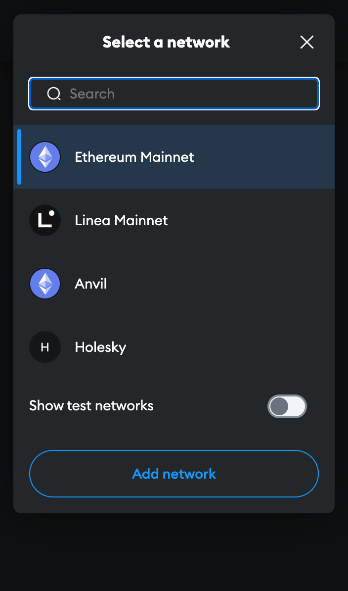
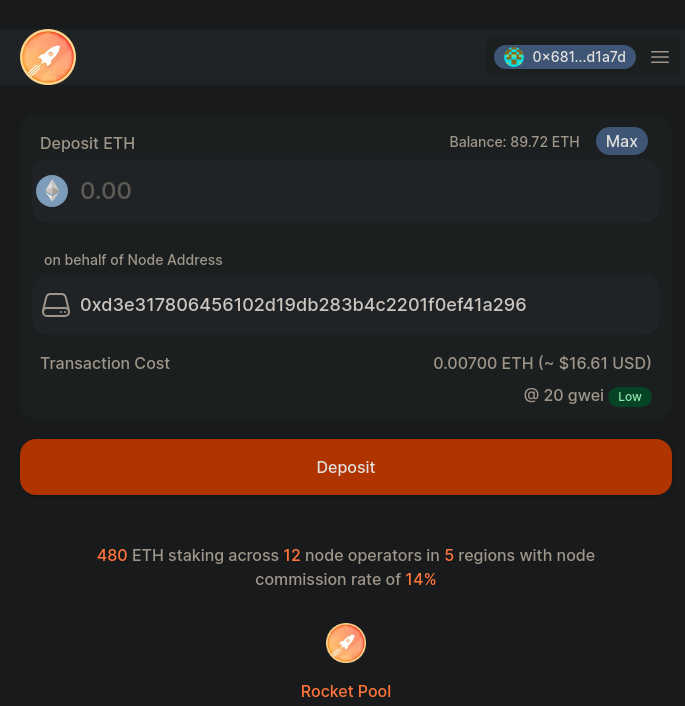

# DRAFT

# Stake ETH on behalf of node 

RPIP-32 allows an account to [stake ETH on behalf](https://rpips.rocketpool.net/RPIPs/RPIP-32) of a Rocket Pool node that is registered in the protocol. This supports a variety of situations where the node operator is not directly providing the ETH:

- Enhanced security for node operators, as they can stake directly from their hardware wallet, eliminating the need to transfer funds to the node beforehand.
- Staking as a Service providers where custody of funds are managed by a trusted custodian.
- Protocol integrations where custody of funds are managed by smart contracts.
- DAOs or organisations where custody of funds are managed by a treasury.

While the primary aim of this feature is to facilitate single depositor scenarios, it’s worth noting that multiple independent depositors can also leverage this capability by creating smart contracts layered on top. Rocket Pool also introduced the ability to stake RPL on behalf of back in our previous Atlas release.

::: warning WARNING
Make sure that you've properly configured the [primary withdrawal address](../node/prepare-node#setting-your-primary-withdrawal-address) of the node you intend on funding. Don't skip this step or else there won't be a way to withdraw your ETH in a trust-minimized fashion. All ETH bond/rewards will be withdrawn to the primary withdrawal address. In other words, the address that supplies ETH for a node should be used as the primary withdrawal address!
:::


The process is slightly different for the Holesky Testnet and Mainnet, so choose the network you are interested in from the tabs below.

:::::: tabs
::::: tab Preparing on the Holesky Testnet

::: danger WARNING
When practicing staking on the test network, you **do not need to provide any of your real ETH** during this process.
You will be given **fake test ETH** to use instead.

**Do not attempt to move your real ETH on mainnet to the testnet or you will lose it permanently!**
:::

Start by installing [MetaMask](https://metamask.io/) if you haven't already.
Follow the instructions on their site to install the extension, create an account, and sign in.

Next, open the MetaMask panel using its icon in your browser toolbar.

You will need to add the Holesky Testnet to MetaMask.

Click on the top left dropdown & click the "Add Network" button.

You will see a list of networks, Holesky is not in this list so click the "Add a network manually" button.

Fill in the following details:

{ style="display: block; margin: 0 auto" }

```
Network Name: Holesky
New RPC Url: https://rpc.holesky.ethpandaops.io
Chain ID: 17000
Currency Symbol: ETH
Block Explorer Url: https://holesky.etherscan.io
```

Then click Save. You should now see the Holesky network in the top left dropdown.

Click on the **network dropdown** in the top left of the Metamask extension & select **Holesky Test Network**:

{ style="display: block; margin: 0 auto" }

Now that you have a wallet address in MetaMask, you need to fill it with some test ETH.
Head over to the [Practicing with the Test Network](../testnet/overview#getting-test-eth-on-holesky) page for a quick guide on how to use a testnet faucet to get some test ETH on Holesky.

Once you have some Holesky ETH to test with, head to [https://testnet.rocketpool.net/manage/deposit-eth-on-behalf-of-node](https://testnet.rocketpool.net/manage/deposit-eth-on-behalf-of-node).

The page should look like this:

{ style="display: block; margin: 0 auto" }

If you see a notice about a web3 browser being required, or the current network ID being unsupported, make sure you’ve completed the previous steps correctly before continuing.

::::: tab Preparing on the Ethereum Mainnet

Start by installing [MetaMask](https://metamask.io/) if you haven't already.
Follow the instructions on their site to install the extension, create an account, and sign in.

Next, open the MetaMask panel using its icon in your browser toolbar.
Click on the **network dropdown** in the toolbar at the top and ensure that **Ethereum Mainnet** is selected:

{ style="display: block; margin: 0 auto" }

Now that you have a wallet address in MetaMask, you need to transfer some ETH into it.
You will need to supply this from an existing wallet or buy ETH on an exchange.

Once you have some ETH to stake, head to [https://stake.rocketpool.net/manage/deposit-eth-on-behalf-of-node](https://stake.rocketpool.net/manage/deposit-eth-on-behalf-of-node).

If you see a notice about a web3 browser being required, or the current network ID being unsupported, make sure you’ve completed the previous steps correctly before continuing.

::::::

Once you're at the site, click on the **connect wallet** button. Please read through and accept the Terms of Service & Privacy Policy, this will enable different ways to connect, then click **connect metamask**.

MetaMask will prompt you to select an account to connect to the website.
Choose one, confirm a few permissions. You'll see an overview of your balances by clicking the wallet icon located at the top right of the window.

From here, you'll want to enter the address of the node you'd like to deposit ETH on behalf of. The page should look like this:

{ style="display: block; margin: 0 auto" }

Go ahead and paste your desired address into this box and click find. For the purpose of this example, we'll use `0xd3e317806456102d19db283b4c2201f0ef41a296`

{ style="display: block; margin: 0 auto" }

In the first box, enter the amount of ETH you would like to deposit on behalf of the node. The second box indicates which address you'll be depositing ETH on behalf of. Please ensure that you've entered the correct address and deposit. Once you're satisfied, click Deposit and MetaMask will pop up with a window asking you to confirm your transaction.

Once you confirm it, the transaction will begin.
When it's been included in a block and added to the chain, your delegate will be able to use the command `rocketpool node status` in smartnode to see the new balance. This balance can also be viewed through the Rocket Pool staking site. 
```
The node has 0.000000 ETH in its credit balance and 8.000000 ETH staked on its behalf. 8.000000 can be used to make new minipools.
```

::: warning NOTE
If a node operator deposits your ETH into a minipool, you won't be able to permissionlessly exit their minipool, so keep this in mind! You can use the Rocket Pool staking site to withdraw ETH staked on behalf of a node if it isn't being used in a minipool. 
:::

That's it!
You're now staking with Rocket Pool.

# Unstake ETH on behalf of node 

When you're ready to withdraw ETH you've staked on behalf of a node, head over to the [staking site](https://devnet.rocketpool.net/manage/withdraw-eth) and select 'Withdraw ETH' in the dropdown menu. After signing in as the node's [primary withdrawal address](../node/prepare-node#setting-your-primary-withdrawal-address), you should be greeted with a familiar menu. You'll be prompted to enter the node address you want to withdraw from:  

{ style="display: block; margin: 0 auto" }

After entering an address, clicking "Find" will take you to the next menu where you can withdraw ETH you've staked on behalf of that node.

{ style="display: block; margin: 0 auto" }

You'll be able to see how much ETH is available for withdrawal in the top right. After you input your desired quantity and confirmed the node address, click 'Withdraw ETH'

Once the transaction is confirmed, you'll see the proper balances in your account!
